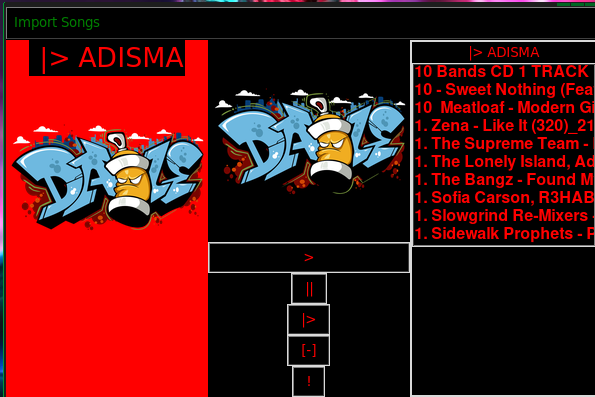

# ADISMA |>


Adisma is a tkinter class based music player with a focus on learning
to easily structure projects for easier use


## Authors and Acknowledgement

- [@michelangeloTM](https://www.github.com/michelangeloTM) for development and design.

  
## Badges


[]()

## Contributing

You are welcome to contribute to this project


  
## Installation 

Install my-project with npm

```bash 
  pip install -r requirements.txt
```
    
## Deployment

To deploy this project run

```bash
  python3 main.py
```

  
## Screenshots



  
## Tech Stack

**MODULES:** Tkinter, Pygame
